# IoT Mini Project 1

## Introduction

Welcome to the IoT Mini Project 1 repository! This project aims to demonstrate the implementation of a simple Internet of Things (IoT) solution. Whether you're a student, developer, or enthusiast, this project provides a hands-on experience in building a basic IoT system.

## Project Overview

The project focuses on getting data from IOT sensor via IOT Testbed and send it to cloud database. Key features include:
- Create a firmware based on RIOT (https://riot-os.org).
- The firmware should periodically read sensor data and send it towards an IoT Cloud provider.
- Program nodes on FIT-IoT Testbed with our firmware.
- Sending data to the cloud requires
 + a border router
 + multi-hop forwarding towards the border router
- Create a driver for an emulated sensor


## Getting Started

Follow these steps to get the project up and running on your local machine or IoT device.

### Prerequisites

In order to run this code, you need to have account in 
- IOT Testbed https://www.iot-lab.info/testbed
- AWS IoT Cloud
- IDE such as Visual Studio Code https://code.visualstudio.com/ 
[List any prerequisites or dependencies that need to be installed before running the project. For example, specific hardware, software, or libraries.]

### Installation
Here is all steps by steps installing this project.
1. Create your IOT Testbed account. https://www.iot-lab.info/testbed

2. Link your SSH key to IOT Testbed by following this instruction https://www.iot-lab.info/docs/getting-started/ssh-access/


3. Open Visual Studio Code and connect to host:
- Firstly, modify config file like this:

Host and Hostname you must keep the same, and change your User to your Testbed's username and IdentityFile is the link to your private key.
- Then you now can connect to your Testbed folder like this:

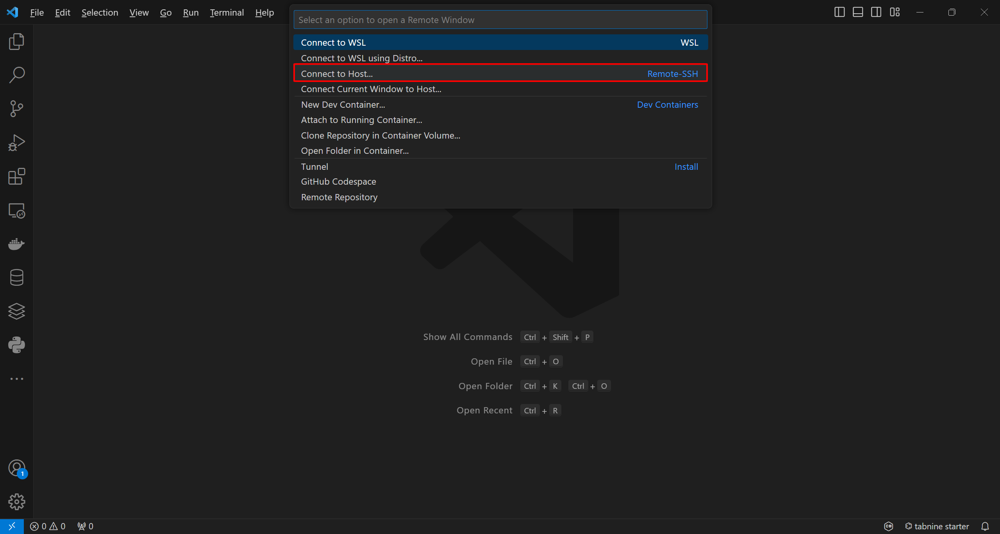
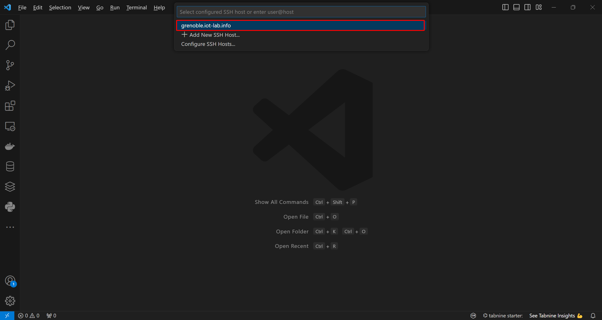

After seeing SSH: grenoble.iot-lab.info appeared on your bottom left corner, you has successfully connected to your Testbed.
Now click on "Open folder" button. 
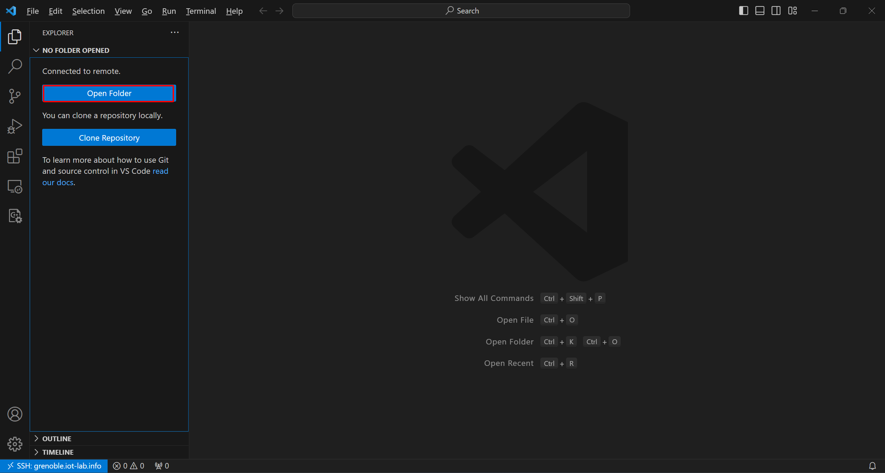

Then click OK
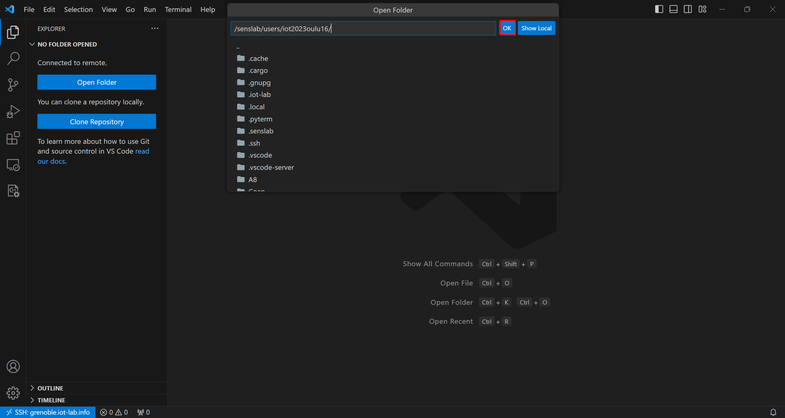

4. Clone our repository to your IOT Testbed folder at the default branch.
- Open terminal on VScode
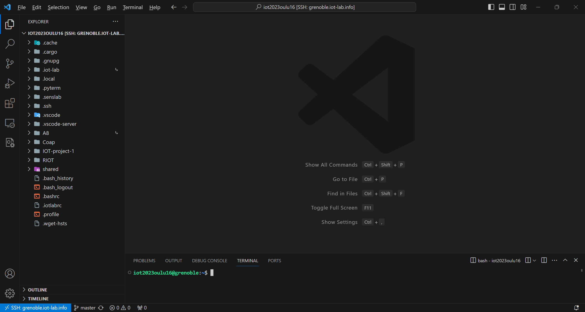
- Clone our repo:
```shell
git clone https://github.com/manhhungking/IOT-project-1.git
```
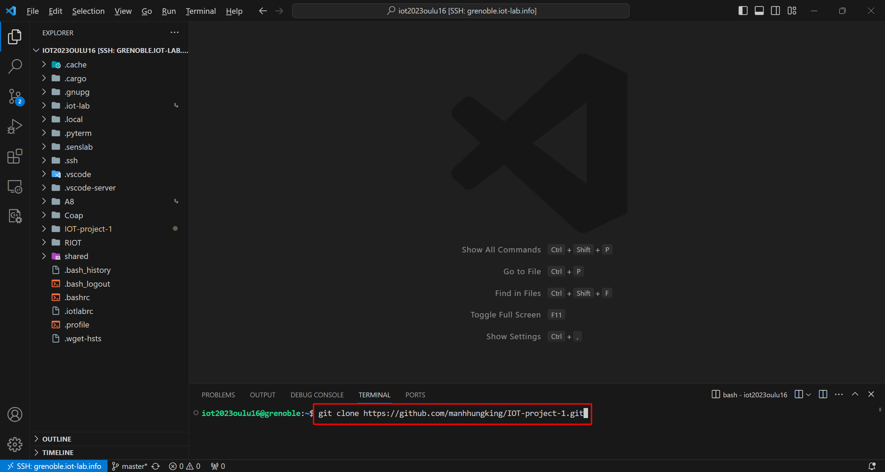
- Clone RIOT
```shell
git clone https://github.com/RIOT-OS/RIOT.git
```
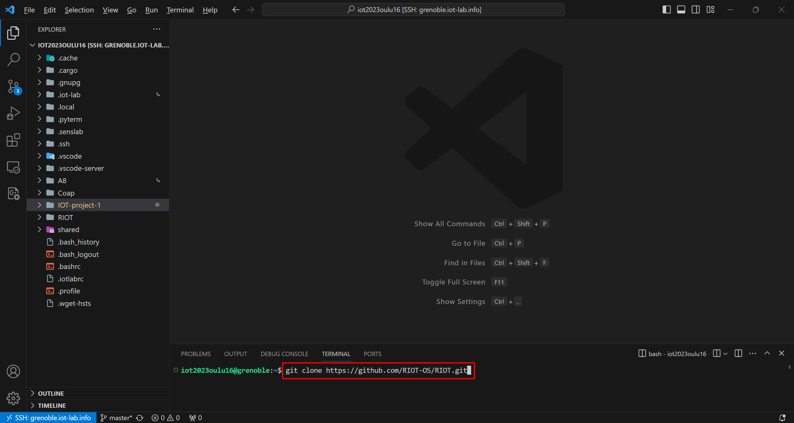
After that, you should have 2 folders like this:
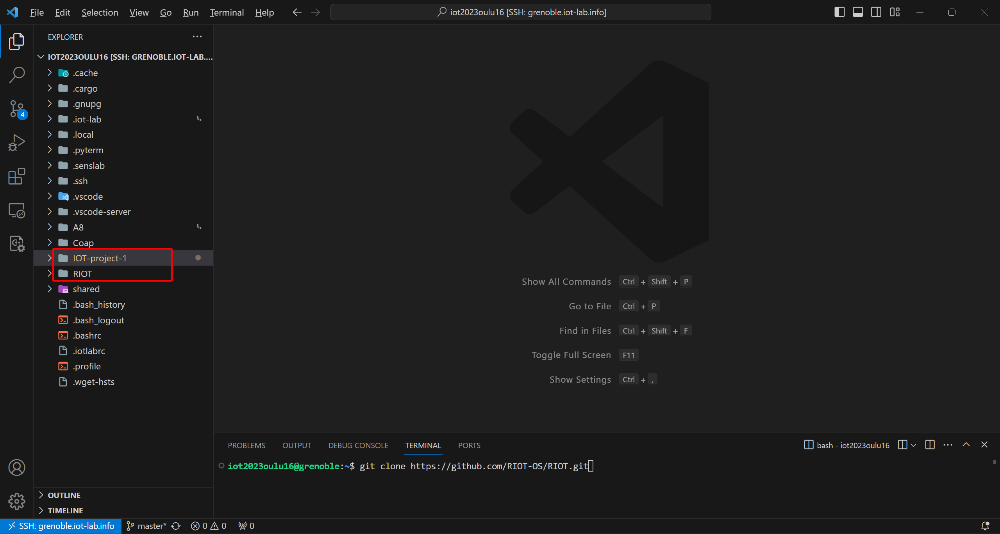
- Navigate to project folder
```shell
cd IOT_Mini_Project1
```
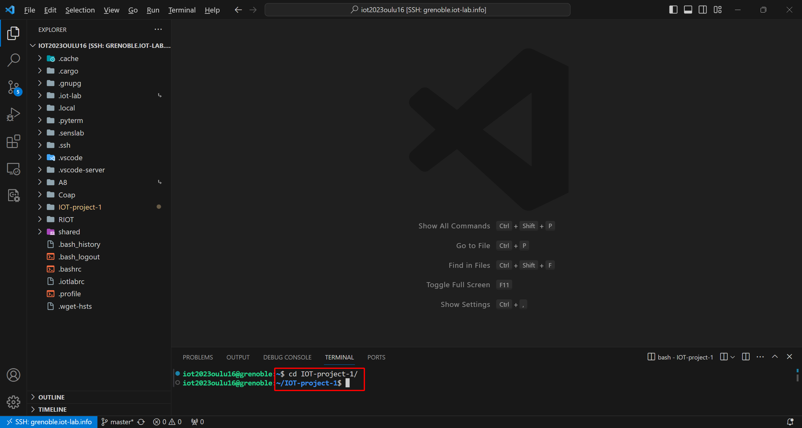
- Building RIOT on the SSH frontend requires a recent ARM gcc toolchain, the default is 4.9 and is not compatible. You just have to issue the ```source /opt/riot.source``` command like this:

 
### Usage

In order to run this project after installing it, you should follow this instruction line by line: 

0. Connect to IoT-Lab server using cmd:
```shell
ssh username@grenoble.iot-lab.info
``` 
with username is your Testbed's username: eg. ```ssh iot2023oulu72@grenoble.iot-lab.info```
1. Submit an experiment on IoT-LAB with 2 nodes:
```shell
iotlab-experiment submit -n "IOT_Mini_Project1" -d 300 -l 2,archi=m3:at86rf231+site=grenoble,./bin/iotlab-m3/gcoap_example.elf
```

If error "*** USE_NEWLIB_NANO==1 but nano include folder not found!" appear, you need to type ```source /opt/riot.source``` in your terminal. This will fix that error.

2. Wait for the experiment to be in the Running state:
```shell 
iotlab-experiment wait --timeout 30 --cancel-on-timeout
```
3. Get the experiment nodes list:
```shell
iotlab-experiment --jmespath="items[*].network_address | sort(@)" get --nodes
```
4. Flash the firmware on the iotlab-m3
From here you will choose one node with the CoAP server role and the other one with client role. You need to open a terminal for both nodes. For server and client node, open a new terminal and run the following command by replace "389721" with your experiment number and "103", "104" are your 2 nodes number as in the screenshots belows.
```shell
iotlab-node -i 389721 -l grenoble,m3,103 -up ./bin/iotlab-m3/gcoap_example.elf
iotlab-node -i 389721 -l grenoble,m3,104 -up ./bin/iotlab-m3/gcoap_example.elf
# make DEFAULT_CHANNEL=18 DEFAULT_PAN_ID=0x3be0 IOTLAB_NODE=m3-96.grenoble.iot-lab.info flash
```
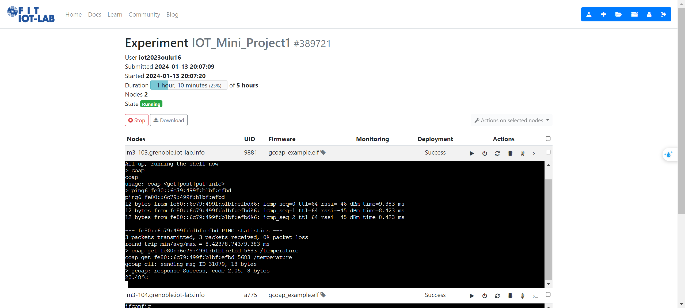
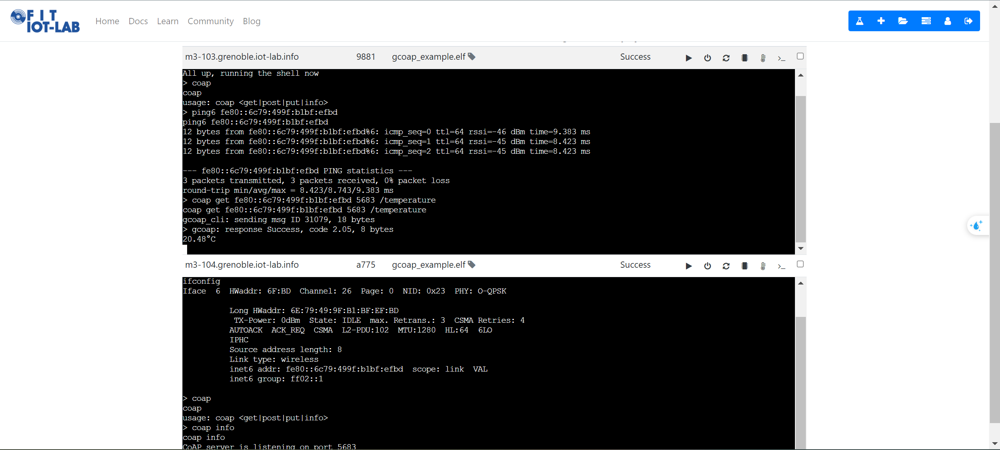
<!-- ```shell
make BOARD=iotlab-m3 IOTLAB_NODE=auto flash
``` -->
Now you should be able to use all command available in our project as below, furthur explaination on these commands will be on below:
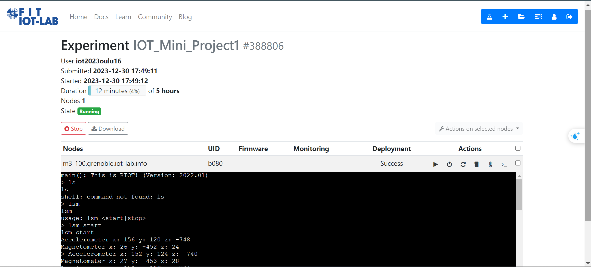

Usage: replace "fe80::e449:92fa:8265:160d" with your ip6 address
```shell
coap get fe80::e449:92fa:8265:160d 5683 /.well-known/core
coap get fe80::e449:92fa:8265:160d 5683 /riot/board
coap get fe80::e449:92fa:8265:160d 5683 /temperature
coap get fe80::e449:92fa:8265:160d 5683 /value
coap put fe80::e449:92fa:8265:160d 5683 /value 8888
coap get fe80::e449:92fa:8265:160d 5683 /value
```
5. Next step:
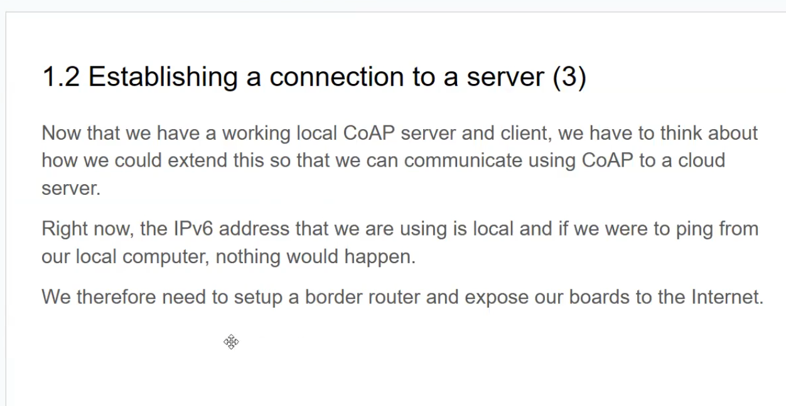

## Project Structure

[Provide an overview of the directory structure and key files in the project. This helps users navigate and understand the organization of the codebase.]
