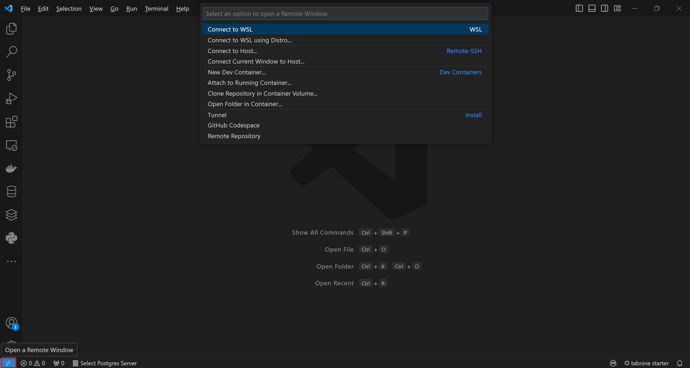
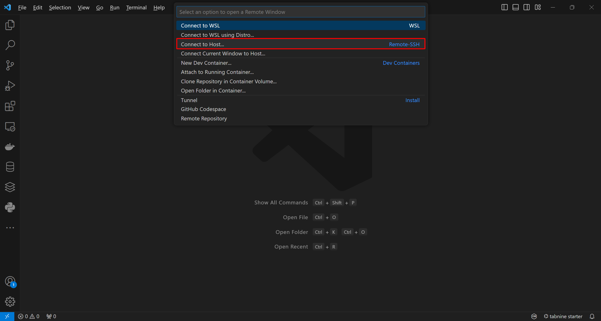
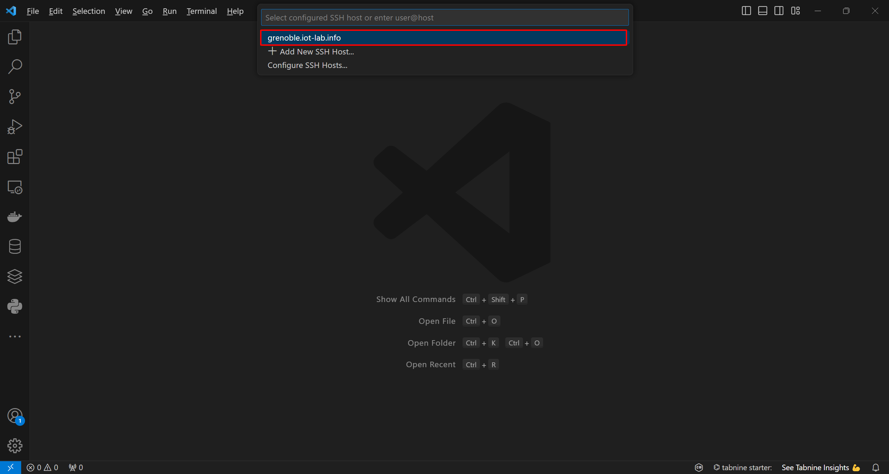
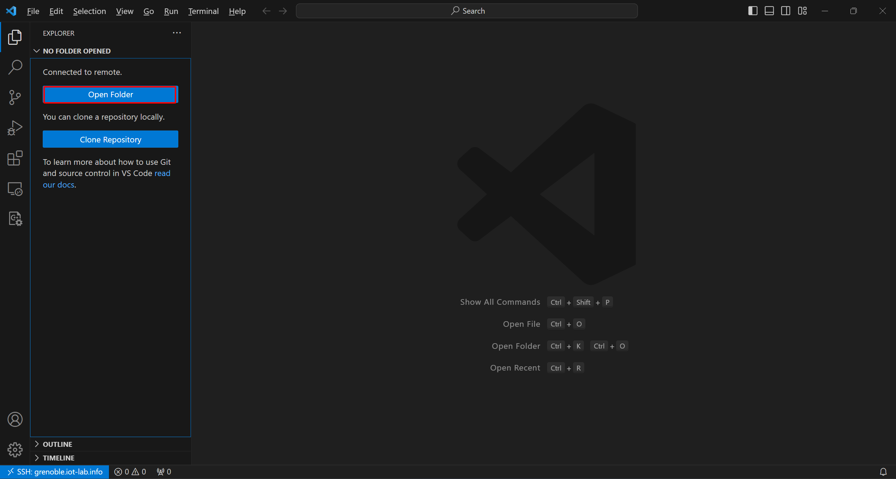
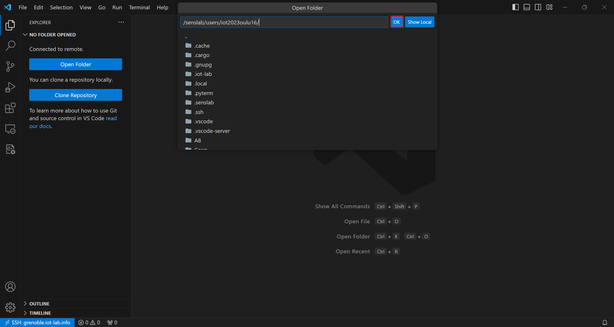
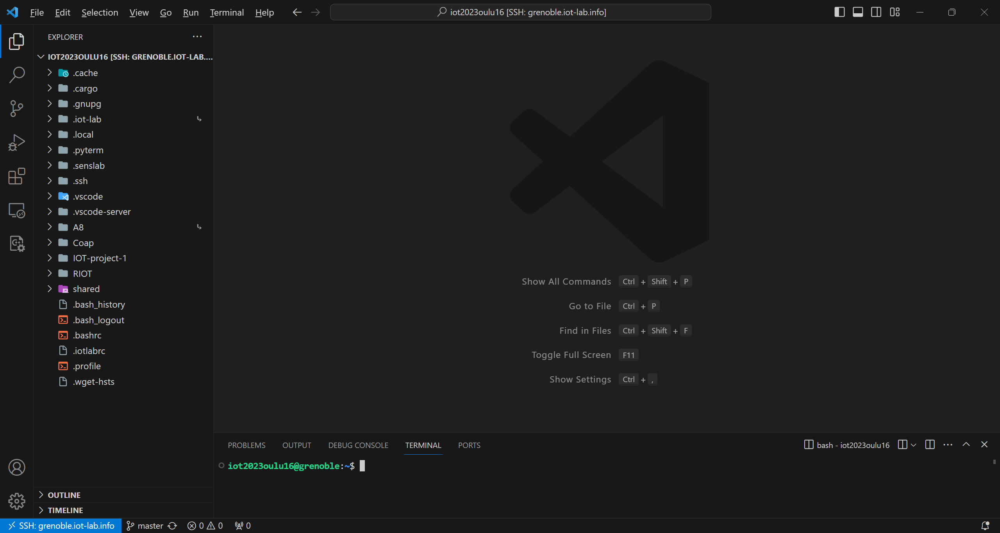
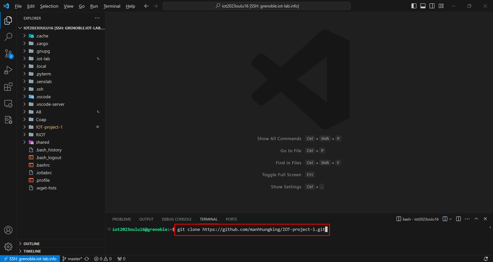
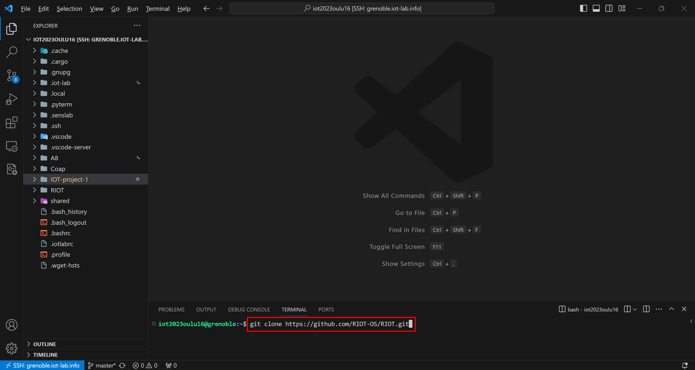
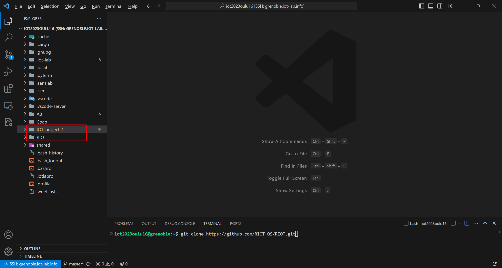
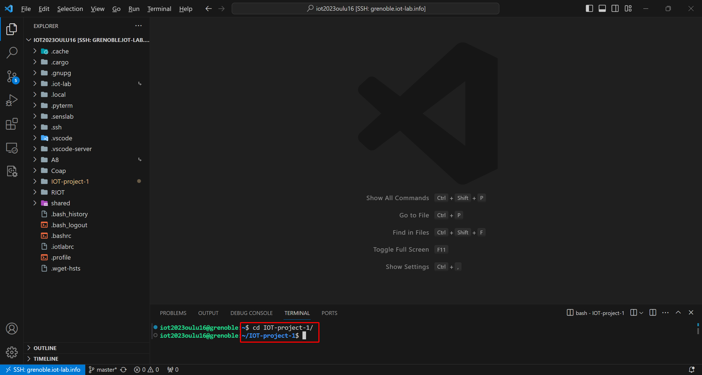

# IoT Mini Project 1

## Introduction

Welcome to the IoT Mini Project 1 repository! This project aims to demonstrate the implementation of a simple Internet of Things (IoT) solution. Whether you're a student, developer, or enthusiast, this project provides a hands-on experience in building a basic IoT system.

## Project Overview

The project focuses on getting data from IOT sensor via IOT Testbed and send it to cloud database. Key features include:
- Create a firmware based on RIOT (https://riot-os.org).
- The firmware should periodically read sensor data and send it towards an IoT Cloud provider.
- Program nodes on FIT-IoT Testbed with our firmware.
- Sending data to the cloud requires
 + a border router
 + multi-hop forwarding towards the border router
- Create a driver for an emulated sensor


## Getting Started

Follow these steps to get the project up and running on your local machine or IoT device.

### Prerequisites

In order to run this code, you need to have account in 
- IOT Testbed https://www.iot-lab.info/testbed
- AWS IoT Cloud
- IDE such as Visual Studio Code https://code.visualstudio.com/ 
[List any prerequisites or dependencies that need to be installed before running the project. For example, specific hardware, software, or libraries.]

### Installation
Here is all steps by steps installing this project.
1. Create your IOT Testbed account. https://www.iot-lab.info/testbed

2. Link your SSH key to IOT Testbed by following this instruction https://www.iot-lab.info/docs/getting-started/ssh-access/


3. Open Visual Studio Code and connect to host:
- Firstly, modify config file like this:

Host and Hostname you must keep the same, and change your User to your Testbed's username and IdentityFile is the link to your private key.
- Then you now can connect to your Testbed folder like this:




After seeing SSH: grenoble.iot-lab.info appeared on your bottom left corner, you has successfully connected to your Testbed.
Now click on "Open folder" button. 


Then click OK


4. Clone our repository to your IOT Testbed folder at the default branch.
- Open terminal on VScode

- Clone our repo:
```shell
git clone https://github.com/manhhungking/IOT-project-1.git
```

- Clone RIOT
```shell
git clone https://github.com/RIOT-OS/RIOT.git
```

After that, you should have 2 folders like this:

- Navigate to project folder
```shell
cd IOT_Mini_Project1
```

- Building RIOT on the SSH frontend requires a recent ARM gcc toolchain, the default is 4.9 and is not compatible. You just have to issue the ```source /opt/riot.source``` command like this:

 
### Usage

1. Build Border Router Firmware
Source RIOT environment
```sh
source /opt/riot.source
```
Build border router firmware for M3 node with baudrate 500000
Note: Use a different 802.15.4 channel if needed
```sh
make ETHOS_BAUDRATE=500000 DEFAULT_CHANNEL=<channel> BOARD=iotlab-m3 -C examples/gnrc_border_router clean all
```


2. Flash Border Router Firmware
Flash the border router firmware to the first M3 node (m3-1 in this case)
```sh
iotlab-node --flash examples/gnrc_border_router/bin/iotlab-m3/gnrc_border_router.elf -l grenoble,m3,<id>
```


3. Configure Border Router Network

Configure the network of the border router on m3-<id>
Propagate an IPv6 prefix with ethos_uhcpd.py
```sh
sudo ethos_uhcpd.py m3-<id> tap0 2001:660:5307:3100::1/64
```

4. Setup MQTT Broker and Mosquitto Bridge on A8 Node
Now, in another terminal, SSH to the SSH frontend, and login into clone the mqtt_broker and mosquitto bridge configuration files in A8 shared directory.
SSH into the A8 node
```sh
ssh root@node-a8-1
```
Check the global IPv6 address of the A8 node
```sh
ifconfig
```

5. Start MQTT Broker
From the A8 shared directory, start the MQTT broker using config.conf
```sh
cd ~/A8
broker_mqtts config.conf
```

Configure and Start Mosquitto Bridge
From another terminal on the A8 node, check for existing mosquitto service and stop it

Modify mosquitto.config with the IPv6 address of the Mosquitto broker (e.g., AWS-EC2 instance)


Start Mosquitto service using the modified configuration file
```sh
root@node-a8-3:~/A8/mqtt_bridge# mosquitto -c mosquitto.conf
```

###  Tests
#### Build and Flash Sensor Node Firmware
From another terminal log into SSH front end of grenoble site
Clone the sensor node directory containing Makefile and main.c
Build the firmware for the sensor node using A8 node's IPv6 address and tap-id
```sh
make DEFAULT_CHANNEL=15 SERVER_ADDR=<IPv6 address> EMCUTE_ID=station(tap-id) BOARD=iotlab-m3 -C . clean all
```

#### Flash the sensor node firmware on an M3 node
```sh
iotlab-node --flash ./bin/iotlab-m3/SensorNode.elf -l grenoble,m3,<id>
```


#### Connect to Sensor Node
Log into the M3 node
```sh
nc m3-<id> 20000
```

### Setting Up EC2 Instance

1. Create a new Subnet and VPC. Make sure to add IPV6 CIDRs on the Subnet and VPC.
2. Enable Public Routes for both IPV4 and IPv6 on internet gateway.
3. Create a new Security Group and enable PORT 1883. Also enable ICMP for IPv4 and IPv6. 
4. Create a new EC2 Instance and assign these newly created resources to it. Also assign a IPv6 to the instance.
5. Generate key pair to ssh in to the EC2.

Access the EC2 instance via SSH and execute the following commands to install the Mosquitto broker:

Add Mosquitto PPA repository: sudo apt-add-repository ppa:mosquitto-dev/mosquitto-ppa

**Update the package list:** sudo apt-get update

**Install Mosquitto:** sudo apt-get install mosquitto

**Install Mosquitto clients:** sudo apt-get install mosquitto-clients

**Clean the package cache:** sudo apt clean


Check the status of the Mosquitto service to ensure it's running:

```sh
sudo service mosquitto status
```

Run the node Influxdb container on EC2 instance:

```sh
docker run --name influxdb -p 8086:8086 influxdb:2.2.0
```
Run the node Grafana container on EC2 instance:

```sh
docker run -d --name=grafana -p 3000:3000 grafana/grafana


